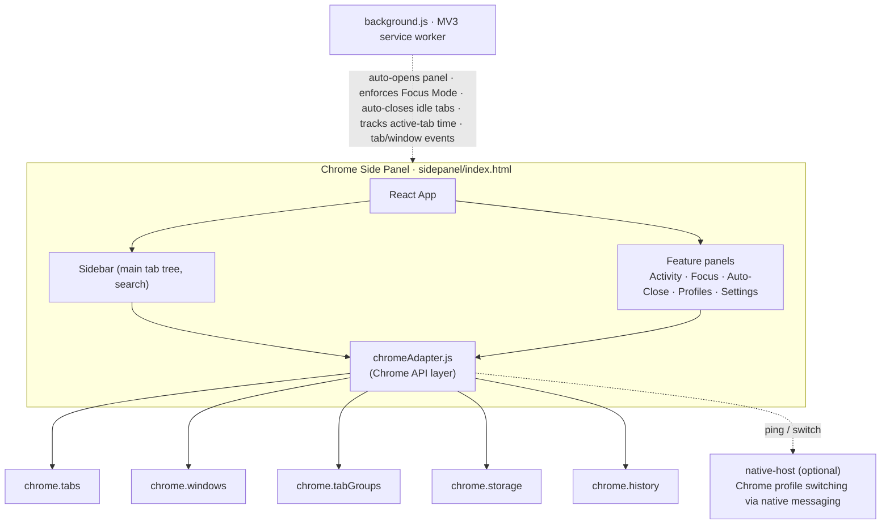

<h1 align="center">Tab Radar</h1>

<p align="center">
  A Chrome side panel to find, switch, clean up, and focus your tabs and windows — without leaving the browser.
</p>

<p align="center">
  <a href="https://github.com/chethanbhatbs/tab-radar/releases/latest/download/tab-radar.zip"></a>
  &nbsp;
  <a href="https://chethanbhatbs.github.io/tab-radar/"></a>
</p>

<p align="center">
  <sub>Download the zip, then <code>chrome://extensions</code> → Developer mode → Load unpacked · Manifest V3 · 100% private</sub>
</p>

---

## Table of Contents

- [Features](#features)
- [Installation](#installation)
- [Keyboard Shortcuts](#keyboard-shortcuts)
- [Architecture](#architecture)
- [Development](#development)
- [Project Structure](#project-structure)
- [Tech Stack](#tech-stack)
- [Privacy](#privacy)

---

## Features

### Tab Tree View
See all your windows and tabs in a collapsible tree. Tabs are organized by window, with Chrome tab groups shown with matching colored borders. Collapse or expand any window or group. Each window shows a summary of its most-visited domains.

### Fuzzy Search
Find any tab instantly by typing in the search bar. Matches against both title and URL with highlighted results. Suggestions appear as you type for quick switching.

### Command Palette (`Cmd+K`)
Spotlight-style quick switcher. Press `Cmd+K` (or `Ctrl+K`) to open, type to filter, arrow keys to navigate, Enter to switch. The fastest way to get to any tab.

### Sites View (Domain Grouping)
Toggle between window-based and domain-based views. Sites view groups all tabs by their domain (e.g., all GitHub tabs together, all Google Docs tabs together) with favicons and tab counts.

### Multi-Select & Bulk Close
Click the **Select** button in the toolbar to enter selection mode. Checkboxes appear on every tab. Select individual tabs, select all in a window, or select all. Then bulk-close them in one click. A floating action bar shows the count and provides Select All / Clear / Close actions.

Two ways to close from the action bar:
- **Close N** — closes the tabs you selected.
- **Close rest (N)** — the inverse: keeps the tabs you selected and closes everything else. Handy when you only want to keep two tabs out of fifty. It always asks for confirmation first, and the prompt tells you if any window will disappear entirely.

Both show an **Undo** in the toast afterwards, and both keep pinned tabs and tabs hidden by Focus Mode. Right-clicking a tab and choosing **Close other tabs** follows the same rules, scoped to that tab's window.

### Focus Mode
Pick the tabs you want to concentrate on and start a focus session. Focus Mode is **non-destructive**, it never closes your content tabs or windows:
- Your focus set stands out; other tabs are dimmed / grouped
- Switching to a non-focus tab or window gently redirects you back, your other tabs and windows stay open
- Only brand-new **blank** tabs (Ctrl/Cmd+T) are auto-closed; nothing with content is ever destroyed
- A lightweight periodic guard plus event listeners keep you on track; an always-visible Exit ends the session
- Focus state persists across panel reloads and syncs across all windows

### Local Favicons
Favicons come from Chrome's built-in `_favicon` API, served from Chrome's own local favicon cache:
- **Zero network requests** — tab URLs never leave your browser to fetch an icon
- Works for internal/private domains (localhost, `.local`, `.corp`, VPN-only hosts) exactly like public ones
- **CSS drop-shadow** safety net ensures favicon contrast in both light and dark themes
- Fallback chain when Chrome has no cached icon: Chrome's reported favicon → colored letter avatar

### Colored Letter Avatars
When no favicon is available after all fallbacks, a vibrant colored letter avatar is generated:
- First letter of the domain, displayed in a rounded badge
- Deterministic color from a palette of 12 vibrant colors (hash-based, so the same domain always gets the same color)
- Replaces the old grey placeholder box for a polished look

### Smart Workspaces
Save collections of tabs as named workspaces. Create workspaces like "Dev", "Research", or "Media" with custom icons (16 options) and colors. Activate a workspace to show only its tabs, everything else is hidden. Workspace state syncs across windows via `chrome.storage`. Duplicate workspace names are prevented.

### Session Manager
Snapshot your entire browser state (all windows and tabs) with a name. Restore any saved session later to reopen everything exactly as it was. View the tab list inside any session before restoring. Duplicate session names are prevented.

### Tab Suspension
Suspend inactive tabs to free up memory. Suspended tabs remain in the sidebar but are visually dimmed. Suspend all inactive tabs at once, or suspend/unsuspend individual tabs via right-click. The stats bar shows the current suspended count.

### Auto-Close Rules
Set time-based rules to automatically close idle tabs. Choose from presets (15min, 30min, 1hr, 2hr) or set a custom timer. Whitelist specific domains (e.g., `mail.google.com`) to keep them safe, subdomain-aware matching means whitelisting `google.com` also protects `docs.google.com`. The at-risk tab preview shows which tabs will be closed and how much time they have left. Tabs are **actually auto-closed** when their inactivity timer expires, with a toast notification for each closed tab. Tab activity is tracked in real time, switching to a tab immediately removes it from the at-risk list.

### Duplicate Detection
Duplicates are automatically detected and highlighted with a badge. The stats bar shows the duplicate count. The duplicate panel at the bottom lists all duplicates grouped by URL, with one-click "Close All Duplicates". Detection includes `chrome://` and `chrome-extension://` pages (new tab, settings, etc.).

### Tab Notes
Right-click any tab to attach a note. Notes persist across sessions via `chrome.storage` and show as a small badge on the tab. A dedicated Notes panel lists all annotated tabs for quick reference.

### Activity Heatmap
Visualize your browsing patterns with an interactive heatmap. View activity across Today, This Week, or This Month. The heatmap shows tab activity by time-of-day using color intensity. Includes a top-sites breakdown showing your most-visited domains.

### Tab Timeline
A 7-day browsing activity grid (GitHub contributions-style). Each cell represents one hour, colored by activity intensity. Click any cell to see active minutes, intensity percentage, and top domains for that hour. Includes a "NOW" indicator, daily breakdown bars, and a color legend. Live data from `chrome.history`.

### Chrome Profile Switching
Switch between Chrome profiles directly from the sidebar. Requires a one-time native messaging host setup (lightweight Python script). Features:
- **Profile list** with avatars, names, and email addresses
- **One-click switch** to any profile (opens that profile's Chrome window)
- **Sync Profiles** button to pick up newly created profiles
- **Remove profiles** from Tab Radar (per-profile, without affecting Chrome)
- **Identity selection**, each Chrome profile identifies itself via user selection, cached per-profile in `chrome.storage.local`
- **Setup wizard** with copy-paste Terminal commands and safety notice

### Drag & Drop
Reorder tabs within a window by dragging. Drag tabs between windows to move them. A drop indicator shows exactly where the tab will land. Pinned tabs cannot be dragged (a toast explains why).

### Window Management
- **Rename windows** by double-clicking the window name (duplicate names prevented)
- **Close windows** with confirmation dialog
- **Minimize/restore windows** from the window menu
- **Create new tabs** in any window from the window menu
- Side panel **auto-opens in new windows**

### Cross-Window Sync
All state syncs across windows in real time:
- **Theme**, change dark/light mode in one window, all windows update
- **Focus mode**, start/exit focus in one window, all windows follow
- **Active workspace**, activate/deactivate syncs everywhere
- **Settings**, any preference change propagates immediately

### Notifications
Toast notifications for all actions (close, duplicate, suspend, mute, etc.) with opaque styling. All notifications auto-dismiss within 2 seconds. Undo support on tab close. Focus Mode blocked-action notifications appear both in the sidebar and as page-level overlays.

### Stats Bar & Profile Switcher
A persistent footer combining live metrics and profile switching:
- **Tabs**, total open tab count
- **Audio**, tabs currently playing audio
- **Paused**, suspended tab count
- **Dupes**, duplicate tab count
- **Profile dropdown**, quick switch profiles, manage profiles, re-identify

### Settings Panel
- **Show favicons**, toggle tab favicons on/off
- **Show URLs**, display URLs under tab titles
- **Compact mode**, tighter spacing for more tabs on screen
- **Confirm actions**, require confirmation before destructive actions
- **Theme**, Light / Dark / System

### Help Panel
Categorized feature guide organized into "Find & Navigate", "Organize & Focus", and "Save & Automate" sections. Includes keyboard shortcuts reference and a feedback button.

### First-Time Tour
A guided tour highlights key features when you first install Tab Radar.

---

## Installation

### Quick Install (3 steps)

1. **Download the latest [`tab-radar.zip`](https://github.com/chethanbhatbs/tab-radar/releases/latest/download/tab-radar.zip)** (built and attached by CI on every release) and extract it to a folder you keep around.

2. **Load in Chrome:**
   - Open `chrome://extensions/` in Chrome
   - Enable **Developer mode** (toggle in top right)
   - Click **Load unpacked** and select the extracted folder

3. **Open Tab Radar:**
   - Click the Tab Radar icon in the toolbar, OR
   - Press `Ctrl+Shift+E` (or `Cmd+Shift+E` on Mac)
   - The sidebar panel opens with all your tabs

### Build from source

The built sidepanel bundle is not committed — build it yourself in one step:

```bash
git clone https://github.com/chethanbhatbs/tab-radar.git
cd tab-radar/frontend && yarn install && cd ..
bash build-extension.sh
```

Then load `extension/tabpilot` via **Load unpacked** as above. After code changes, re-run `build-extension.sh` and reload the extension.

5. Click the Tab Radar icon in the toolbar (or press `Cmd+Shift+E`) to open the sidebar.

6. **(Optional) Set up profile switching:**
   ```bash
   cd native-host
   bash install.sh
   # Paste your extension ID when prompted (find it at chrome://extensions)
   ```
   Then restart Chrome. The Profiles panel will now show your Chrome profiles.

---

## Keyboard Shortcuts

| Shortcut | Action |
|----------|--------|
| `Cmd+Shift+E` | Toggle Tab Radar sidebar |
| `Cmd+K` / `Ctrl+K` | Focus the search bar |
| `↑` `↓` | Navigate through tabs |
| `Enter` | Switch to selected tab |
| `Delete` / `Backspace` | Close selected tab |
| Right-click | Context menu (pin, mute, move, copy URL, add note) |

---

## Architecture



### Key Design Decisions

- **Display-layer filtering**: Hidden tabs (from focus mode / workspaces) are filtered at the UI display layer, not the data layer. This keeps `tabs.allTabs` complete for operations like workspace activation and session saving.
- **chrome.storage for cross-window state**: Focus mode, active workspace, theme, and settings all persist to `chrome.storage.local` with `onChanged` listeners for real-time sync.
- **Per-window tab grouping**: `chrome.tabs.group` only works within a single window, so hiding tabs groups them per-window separately.
- **Adaptive hooks**: Both `useMockTabs` and `useChromeTabs` are always called (React rules of hooks). The adapter selects based on runtime context, extension uses real Chrome APIs, web preview uses mock data.
- **Background-enforced Focus Mode**: Focus Mode restrictions are enforced in `background.js` (service worker), not just the UI. This ensures tabs/windows are blocked even if the sidebar is closed. Blocked-action notices show as toasts in the side panel — no code is ever injected into web pages.
- **Local favicon routing**: All favicons are served by Chrome's built-in `_favicon` API from the local favicon cache, so the extension makes zero external requests and internal/VPN-only domains work like public ones.

---

## Development

### Web Preview (no extension needed)

```bash
cd frontend
npm install
npm start
```

Opens at `http://localhost:3000` with mock tab data for development.

### Build for Extension

```bash
# From repo root — builds the React app and packages it into extension/tabpilot/sidepanel
./build-extension.sh
```

---

## Project Structure

```
tab-radar/
├── extension/tabpilot/          # Chrome extension (load this in chrome://extensions)
│   ├── manifest.json            # MV3 manifest
│   ├── background.js            # Service worker (events, focus mode enforcement, notifications)
│   ├── sidepanel/               # Built React app (generated by build-extension.sh, not committed)
│   └── icons/                   # Extension icons
│
├── frontend/                    # React source code
│   ├── src/
│   │   ├── components/tabpilot/ # All UI components
│   │   │   ├── Sidebar.jsx      # Main container, state management, filtering, routing
│   │   │   ├── WindowGroup.jsx  # Window tree with tabs, drag-drop, rename
│   │   │   ├── TabItem.jsx      # Individual tab row with context menu
│   │   │   ├── DomainView.jsx   # Domain-grouped tab view
│   │   │   ├── FocusMode.jsx    # Focus mode with tab selection, timer, confirmation
│   │   │   ├── WorkspaceManager.jsx  # Workspace CRUD + activation
│   │   │   ├── SessionManager.jsx    # Session save/restore/delete
│   │   │   ├── AutoClosePanel.jsx    # Auto-close rules + at-risk preview
│   │   │   ├── HeatmapPanel.jsx      # Activity heatmap visualization
│   │   │   ├── SearchBar.jsx         # Fuzzy search with suggestions
│   │   │   ├── CommandPalette.jsx    # Cmd+K quick switcher
│   │   │   ├── QuickActions.jsx      # Toolbar action buttons
│   │   │   ├── DuplicatePanel.jsx    # Duplicate tab detection + close
│   │   │   ├── StatsBar.jsx          # Footer stats (tabs, audio, paused, dupes)
│   │   │   ├── HelpPanel.jsx         # Categorized help guide
│   │   │   ├── SettingsPanel.jsx     # User preferences
│   │   │   ├── TabNotesPanel.jsx     # Notes management
│   │   │   ├── TabTimeline.jsx       # 7-day activity grid
│   │   │   ├── ProfilePanel.jsx     # Profile management panel
│   │   │   ├── ProfileSwitcher.jsx  # Bottom bar stats + profile dropdown
│   │   │   ├── TabPreview.jsx        # Tab hover preview
│   │   │   ├── TourGuide.jsx         # First-time onboarding
│   │   │   └── TabGroupHeader.jsx    # Chrome tab group header
│   │   │
│   │   ├── hooks/
│   │   │   ├── useChromeTabs.js      # Real Chrome tabs/windows/groups API
│   │   │   ├── useMockTabs.js        # Mock data for web preview
│   │   │   ├── useSearch.js          # Fuzzy search logic
│   │   │   ├── useSessions.js        # Session persistence
│   │   │   ├── useSettings.js        # Settings with chrome.storage sync
│   │   │   └── useHistoryData.js     # Heatmap data from chrome.history
│   │   │
│   │   ├── utils/
│   │   │   ├── chromeAdapter.js      # Chrome API wrappers (tabs, windows, storage)
│   │   │   ├── grouping.js           # Domain grouping, smart favicons, letter avatars, URL normalization
│   │   │   └── mockData.js           # Mock tab/window data
│   │   │
│   │   ├── pages/
│   │   │   └── TabRadarPreview.jsx # Web preview with landing page
│   │   │
│   │   └── components/ui/           # shadcn/ui components
│   │
│   ├── craco.config.js              # CRA override config
│   ├── tailwind.config.js           # Tailwind + custom theme
│   └── package.json
│
├── native-host/                 # Native messaging host for profile switching
│   ├── tabpilot_profiles.py     # Python script (reads profiles, launches Chrome)
│   ├── install.sh               # One-time macOS install script
│   └── com.tabpilot.profiles.json  # Native messaging manifest template
│
└── README.md
```

---

## Tech Stack

| Layer | Technology |
|-------|-----------|
| UI Framework | React 18 |
| Build Tool | Create React App + craco |
| Styling | Tailwind CSS 3 + shadcn/ui |
| Icons | Lucide React |
| Toasts | Sonner |
| Extension | Chrome Manifest V3, Side Panel API |
| State Sync | chrome.storage.local + onChanged listeners |
| Fonts | System font stack (no external font loading) |

---

## Chrome Permissions

| Permission | Purpose |
|-----------|---------|
| `tabs` | Read/modify tabs (title, URL, pin, mute, move, close) |
| `tabGroups` | Create/collapse groups for focus mode and workspaces |
| `sidePanel` | Render the sidebar UI |
| `storage` | Persist settings, notes, workspaces, focus state |
| `sessions` | Undo close tab (restore recently closed) |
| `history` | Activity heatmap data |
| `favicon` | Read favicons from Chrome's local cache (no network requests) |
| `idle` | Pause time tracking when you step away |
| `alarms` | Periodic flush for the active-time tracker and auto-close checks |
| `nativeMessaging` (optional) | Only requested if you enable Chrome profile switching from the Profiles panel |

Tab Radar requests **no host permissions** and injects **no content scripts** — it cannot read or change anything on the web pages you visit.

---

## Privacy

Tab Radar runs **entirely in your browser** and makes **zero network requests**. Nothing is collected or transmitted: no analytics, no tracking, no external favicon services. All data (settings, notes, sessions, workspaces, time stats) lives in `chrome.storage.local` on your machine. Favicons are read from Chrome's local favicon cache via the built-in `_favicon` API. See [PRIVACY.md](PRIVACY.md) for the full policy.

(The hosted [live demo](https://chethanbhatbs.github.io/tab-radar/) — a separate web page with mock data, not the extension — fetches demo favicons from Google's favicon service.)
